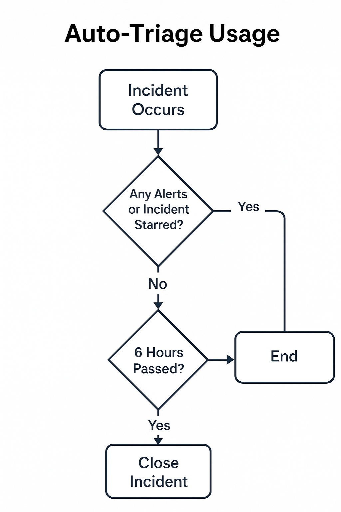

# Auto-Triage Usage

The **Auto-Triage** function is a key automation mechanism within the XSIAM ecosystem. It streamlines the incident queue by automatically closing non-priority incidents that haven’t been starred or linked to starred alerts within a defined timeframe. This logic supports the XSIAM FieldOps goals of minimizing analyst workload, improving signal fidelity, and enforcing hygiene across incident pipelines.

## Auto-Triage Usage

<div align="center">
  
</div>


---

## 🧠 Purpose

Security Operations Centers (SOCs) suffer from alert overload and decision fatigue. Auto-Triage addresses this by:

- Automatically closing incidents that do not contain starred alerts or have not been manually starred.
- Ensuring a 6-hour grace period before automatic closure.
- Freeing analyst attention to focus only on high-fidelity, high-priority incidents.

---

## ⚙️ What It Does

The Auto-Triage playbook executes as part of the incident lifecycle and evaluates:

1. Whether the incident or any associated alerts are starred (`starred == true`).
2. Whether 6 hours have passed since the incident was created.
3. If no starred alerts exist and 6 hours have elapsed, the incident is automatically closed.

---

## 📍 When to Use It

Use this automation when:

- Your SOC enforces a **starring policy** or uses **incident scoring**.
- You want to reduce backlog clutter and increase analyst throughput.
- You’re tracking metrics such as:
  - **Alert Fidelity**
  - **Playbook Execution Rate**
  - **Noise Reduction Efficiency**

---

## 🧪 FieldOps Value Alignment

| Value Driver         | Alignment                                                                 |
|----------------------|---------------------------------------------------------------------------|
| **Transformation**    | Reduces noise and triage fatigue through policy-backed incident cleanup. |
| **Automation & Efficacy** | Drives efficiency by eliminating manual closure of irrelevant incidents. |
| **Risk & Resiliency** | Frees analysts to focus on high-priority threats by clearing distraction. |

---
## 💡 Best Practices

- 🔁 **Pair with Incident Scoring:**  
  Use Auto-Triage alongside your incident scoring system to create a closed-loop feedback mechanism that continuously refines your starring policy.

- 🔍 **Review Auto-Closed Incidents Weekly:**  
  Regularly audit automatically closed incidents to ensure no meaningful alerts are being missed. This helps tune thresholds and improve confidence in automation.

- 📊 **Track in Dashboards:**  
  Monitor key indicators such as:
  - `Unreviewed Incident Closure Rate`
  - `False Negative Drift`
  - `Playbook Execution Success`
  
  These metrics will surface whether auto-triage is helping or hurting fidelity.

- 🛠️ **Adjust the 6-Hour Window as Needed:**  
  Depending on your SOC tempo, you may want to shorten or lengthen the time threshold. Align it with your average MTTA (mean time to acknowledge).

- 🚨 **Always Preserve Escalation Pathways:**  
  Ensure your auto-triage logic never closes incidents that have passed through critical detection policies, high-severity alerts, or manual tagging.

---

## 🧩 Example Logic Snippet

```python
if incident.starred == false and \
   all(alert.starred == false for alert in incident.alerts) and \
   incident.creation_time + timedelta(hours=6) <= now:
    close_incident(reason="Auto-Triage: No starred alerts after 6 hours")
