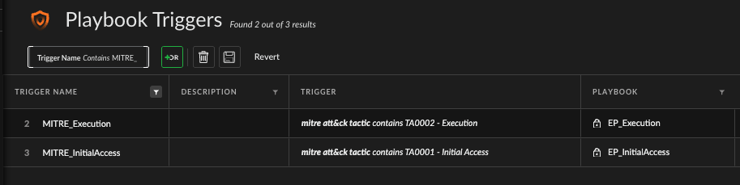

# 🟢🔵 Blue/Green Playbook Deployment for Cortex XSIAM

This README explains how to use the **Blue/Green Playbook Deployment model** in Cortex XSIAM using the `DeployPlaybook` automation script. This model lets you safely test and promote playbooks while maintaining production stability.

An **Entry Point (EP)** is a playbook triggered after the creation of an alert. In this case we are filtering these by MITRE Tactic. They are configured in the **Playbook Triggers** settings of Cortex XSIAM.

---

## 📘 Overview

Each entry point (EP) playbook has two deployment states:
- **`prod`**: the active production playbook
- **`green`**: a staging version for testing and validation

The model is managed through a system list named `PlaybookDeploymentMatrix`, which tracks:
- EP name (e.g., `EP_Execution`)
- Status (enabled/disabled)
- Playbooks assigned to `prod` and `green`
- Current deployment state
- Optional backup history
- You **must detach** the list in order to make changes.
---

## 🛠️ Actions Supported by the Script

Use the `!DeployPlaybook` automation command with one of the following actions:

| Action     | Required Args                        | Description |
|------------|--------------------------------------|-------------|
| `list`     | –                                    | Show all EPs with status, prod, and green assignments |
| `create`   | `entry_point_name`                   | Create a new EP with empty prod/green, disabled by default |
| `delete`   | `entry_point_name`                   | Remove an EP entry |
| `enable`   | `entry_point_name`                   | Allow this EP to be used in deployment actions |
| `disable`  | `entry_point_name`                   | Prevent this EP from being changed or used |
| `show`     | `entry_point_name`                   | Show status of a specific EP |
| `stage`    | `entry_point_name`, `playbook_name`  | Assign a new playbook to the `green` slot after validation |
| `deploy`   | `entry_point_name`                   | Promote `green` → `prod` and backup old prod |
| `rollback` | `entry_point_name`                   | Revert to previous `prod` by swapping with `green` |

---

## 🚦 Workflow Example

### 1. Create a New Entry Point
```bash
!DeployPlaybook action=create entry_point_name=EP_Execution
```

### 2. Enable the Entry Point
```bash
!DeployPlaybook action=enable entry_point_name=EP_Execution
```

### 3. Stage a Playbook for Testing
```bash
!DeployPlaybook action=stage entry_point_name=EP_Execution playbook_name="MITRE - Execution v1.2"
```

### 4. Promote to Production (Deploy)
```bash
!DeployPlaybook action=deploy entry_point_name=EP_Execution
```

### 5. Rollback to Previous Version (if needed)
```bash
!DeployPlaybook action=rollback entry_point_name=EP_Execution
```

### 6. View the Current Status
```bash
!DeployPlaybook action=show entry_point_name=EP_Execution
```

---

### 🧪 Validation

- Every playbook is validated via the `/xsoar/public/v1/playbook/search` API before being accepted in the green slot.
- If a playbook name is incorrect or inaccessible, staging and deploy will fail.

### 🔐 Safety Features

- You **must enable** an EP before using stage, deploy, or rollback.
- EPs start out **disabled by default** to prevent accidental changes.
- Deploy and rollback actions **automatically create a backup** with a timestamp.

---

## 📋 List Format Example (`PlaybookDeploymentMatrix`)
```json
[
  {
    "name": "EP_Execution",
    "enabled": true,
    "deployment": "prod",
    "prod": "MITRE - Execution v1.1",
    "green": "MITRE - Execution v1.2",
    "backup": {
      "playbook": "MITRE - Execution v1.0",
      "timestamp": "2025-07-06T12:00:00Z"
    }
  }
]
```

---

## 📂 Included Entry Point Playbooks

The following EP playbooks are currently tracked in this SOC Optimization project:

- EP_InitialAccess
- EP_Execution
- EP_Persistence
- EP_PrivilegeEscalation
- EP_DefenseEvasion
- EP_CredentialAccess
- EP_Discovery
- EP_LateralMovement
- EP_Collection
- EP_CommandAndControl
- EP_Exfiltration
- EP_Impact
- EP_IdentityAnalytics
- EP_CloudPosture

---

## 🧼 Cleanup and Deletion
To remove an old or deprecated entry point:
```bash
!DeployPlaybook action=delete entry_point_name=EP_Execution
```

---

## 📎 Notes
- Works in Cortex XSIAM 2.6+ with `core-api-post` enabled
- The list `PlaybookDeploymentMatrix` exist as a system-level list
- The playbook must be available and accessible in the current tenant

---
