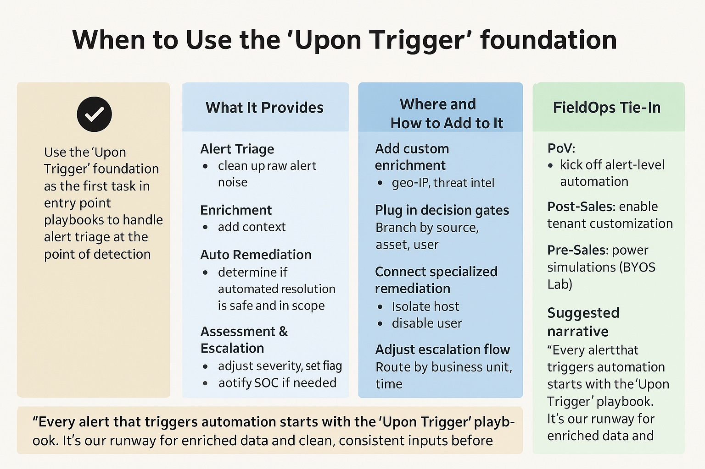

# ⚙️ Upon Trigger Foundation – XSIAM SOC Automation

The **“Upon Trigger”** foundation playbook is the standardized first step for any **entry point playbook** triggered by alerts in XSIAM. It provides structured, modular logic to ensure clean triage, contextual enrichment, and safe, scalable automation from the moment a trigger fires.

---

## ✅ When to Use the “Upon Trigger” Foundation

Use the `Upon Trigger` playbook **as the first task** in:

- Any alert-level **entry point** playbook.
- Alert flows triggered directly from XDR detection logic.
- Use cases focused on **reducing time-to-context** and enabling **automated triage**.
- Automation paths that will expand to include **remediation**, **escalation**, or **case enrichment**.

> This ensures every triggered playbook begins with clean, enriched, and normalized alert data — enabling scalable automation and smart escalation.

---

## 📦 What It Provides

| **Stage**                 | **Value Delivered**                                                       |
|---------------------------|----------------------------------------------------------------------------|
| **Alert Triage**          | Normalize and deduplicate raw alerts                                      |
| **Enrichment**            | Add context: user, host, domain, file, etc.                               |
| **Auto Remediation**      | Evaluate and execute remediation if safe and in scope                     |
| **Assessment & Escalation** | Adjust severity, flag for analyst review, notify if needed              |

---
👉 [See how to adjust this playbook for your industry](../Documentation/CIA_Priorities_Readme.md)
---

## 🧩 Where and How to Add To It

You can extend `Upon Trigger` based on your use case:

### 🔹 Add Custom Enrichment
- Geo-IP history
- Threat intel lookups (e.g., VirusTotal, Recorded Future)

### 🔹 Plug in Decision Gates
- Branch logic by:
  - Alert source (EDR, NDR, Identity, etc.)
  - Asset type (server vs. endpoint)
  - User role (admin vs. standard)

### 🔹 Connect Specialized Remediation
- Isolate endpoint
- Disable user or revoke session
- Remove malicious file or quarantine artifacts

### 🔹 Adjust Escalation Logic
- Route based on:
  - Business unit
  - Time of day
  - Alert type or severity

---

## 📝 Suggested Narrative

> “Every alert that triggers automation in XSIAM starts with the same foundation — the ‘Upon Trigger’ playbook. It ensures we’re working with clean, enriched data before making any decisions. From deduplication to environment detection, it’s the runway for everything we automate. And because it's modular, we can add custom logic or remediation tailored to each use case, without rebuilding from scratch.”

---

## 📁 File Structure Suggestion (Optional)
- /playbooks/
  - upon_trigger_base.yml
  - /enrichment_modules/
    - enrich_user_from_ldap.yml
    - enrich_with_virustotal.yml
  - /remediation_modules/
    - isolate_endpoint.yml
    - disable_user.yml
  - /escalation_flows/
    - notify_soc_slack.yml
    - create_case_escalation.yml

