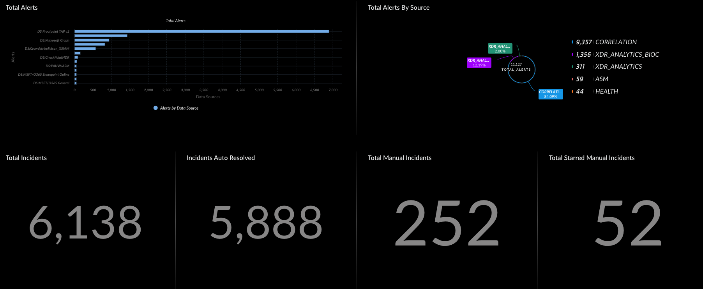

# Value Metrics Usage Guide

This guide explains how to configure and use Value Metrics to measure the time savings, automation impact, and tool utilization across your XSIAM environment.

---

## 📌 What Are Value Metrics?

The Value Metrics dashboard helps quantify automation value by capturing:

- Time saved by task and category
- Usage of scripts vs playbooks
- Vendor and product coverage
- Analyst effort avoided
- Alert-to-incident compression

---

## ⚙️ How Value Metrics Work

The dashboard is powered by **two data sets**:

### 1. Value Tags

Defined manually to describe automation tasks and playbooks with:

- Estimated time savings
- Task category (e.g., enrichment, triage)
- Vendor/product attribution
- Script or playbook identifiers

### 2. Playbook Metrics

Generated automatically by a job included in the **SOC Optimization** content pack.  
It tracks real-time playbook executions and joins them with Value Tags to display actionable metrics.

---

## 🛠️ Configuring Value Tags

To configure Value Tags:

1. Navigate to:  
   `Settings → Configuration → Data Management → Data Management Sets`

2. Find or create a dataset called:  
   `value_tags`

3. Add rows using the following formats:

### ➤ Task-based Tags

| Field      | Description                                        |
|------------|----------------------------------------------------|
| `category` | Task type (e.g., `triage`, `enrichment`)           |
| `tag`      | Friendly task label shown on the dashboard         |
| `time`     | Estimated time saved per task                      |
| `scriptid` | Script or automation command executed              |
| `product`  | Optional: product name tied to the automation      |
| `vendor`   | Optional: vendor associated with the task          |

**Example:**
```json
{
  "category": "enrichment",
  "tag": "URL Detonation",
  "time": 6,
  "script_id": "DetonateURL",
  "product": "WildFire",
  "vendor": "Palo Alto Networks"
}
```
### ➤ Playbook-based Tags

Used to track automation at the playbook level, typically representing a full use case (e.g., phishing response, insider threat investigation).

| Field        | Description                                                                  |
|--------------|------------------------------------------------------------------------------|
| `category`   | Logical grouping, typically set to `use_case`                                |
| `tag`        | Friendly label for the use case (e.g., `Phishing`, `Malware Triage`)         |
| `playbookid` | Identifier for the playbook — can be either the playbook **name** or **UUID** |
| `product`    | (Optional) Product associated with the use case                              |
| `vendor`     | (Optional) Vendor responsible for the product                                |

**Tip:** Use the **playbook name** instead of UUID when possible.  
If using a UUID, you may need to export the playbook and extract the `"id"` field from the JSON.

**Example Entry (JSON-style):**
```json
{
  "category": "use_case",
  "tag": "Phishing Investigation",
  "playbookid": "XSOAR - Auto Phishing Enrichment",
  "product": "Cortex XSOAR",
  "vendor": "Palo Alto Networks"
}
```

## 🧩 What Value Metrics Show You

Break down automation and operational insights into actionable visual metrics:

### 🔧 Time Saved by Task
Quantifies how much effort is saved for each individual automation task:
- IP enrichment
- Proofpoint forensics
- Alert deduplication
- WHOIS lookups
- URL detonations

Use this to identify high-impact automation points.

---

### 📂 Time Saved by Category
Groups automation savings into broader operational domains:
- **Enrichment**
- **Triage**
- **Case Management**
- **Investigation**

Use this to understand where the most analyst time is being saved at a higher level.

---

### 🏷️ Vendor & Product Usage
Shows which vendors and products are being automated — and how often.

Use this to:
- Identify over/underutilized tools
- Align automation investment with license spend
- Justify tool consolidation or expansion

---

### 💡 Scripts vs Playbooks
Displays how often custom scripts are run versus supported playbooks.

Use this to:
- Identify where reusable playbooks should be created
- Reduce script sprawl and technical debt
- Promote sustainable automation patterns

---

### 🧪 Use Case Execution
Measures how often complete use case playbooks are executed:
- Phishing
- Malware
- Identity-based alerts
- Insider threat

Use this to:
- Validate coverage across threat types
- Track use case adoption and maturity

## 🧮 Analyst Effort Equivalency

Use Value Metrics to estimate how much analyst workload is being reduced through automation. This helps translate technical impact into business value.

### 🔢 How to Calculate Analyst Savings

1. **Sum the total time saved** across all tagged tasks and playbooks
2. **Convert minutes to hours** (if needed)
3. **Divide by typical analyst work hours** per month (e.g., 160 hours)
4. **Estimate effort saved** in terms of full-time analyst equivalents
5. Optionally compare against alert handling rate (e.g., 8–13 events/hour)
event-per-hour calculations, this could free up **1–2 analysts** for higher-value tasks.

Use this metric to:
- Quantify operational ROI
- Support staffing justifications
- Demonstrate outcome-based transformation

## 🔁 Alert-to-Incident Funnel

The Alert-to-Incident Funnel illustrates how automation reduces alert volume and analyst workload by filtering, grouping, and resolving alerts before they ever reach a human.

### 📉 Funnel Stages

1. **Raw Alerts Ingested**  
   Alerts received from all data sources (e.g., endpoint, network, email, cloud)

2. **↓ Auto-grouped / Suppressed**  
   Duplicate or low-value alerts are grouped or dropped automatically

3. **↓ Incident Generation**  
   Remaining meaningful alerts form incidents through correlation logic

4. **↓ Auto-Resolved Incidents**  
   Playbooks or policies resolve incidents automatically without analyst input

5. **↓ Manual Incidents Remaining**  
   Final queue of incidents that require human review or decision-making

### 🎯 Why It Matters

- Visualizes the impact of alert triage, suppression, and automation
- Highlights how many alerts are prevented from reaching analysts
- Demonstrates operational efficiency during PoV or steady-state use
- Justifies automation investment and focus policies

### 🖼️ Dashboard Example



## 🖼️ Diagram References

Use the following visual aids to support your Value Metrics documentation:

### 📊 Value Metrics Dashboard

Displays time saved by task and category, script vs. playbook usage, and vendor/product automation distribution.


### 📊 Alert Funneling Dashboard


## ✅ Best Practices

Follow these guidelines to ensure your Value Metrics setup is accurate, sustainable, and useful:

- 🔖 **Use clear and descriptive `tag` names**  
  Makes widgets and dashboards easier to read and interpret.

- 🧾 **Prefer `playbook name` over UUIDs**  
  Simplifies maintenance and reduces errors when tracking use cases.

- ⏱️ **Set realistic `minutes` values**  
  Base estimates on actual analyst workflows to ensure meaningful impact measurements.

- 🏷️ **Include `product` and `vendor` fields**  
  Enables visibility into which tools are providing automation value.

- 📊 **Review metrics regularly**  
  Catch drift in automation adoption and validate that time savings reflect actual operations.

- 🛠️ **Standardize tagging practices**  
  Use naming conventions and CI/CD processes to maintain consistency across environments.

- 🧠 **Correlate metrics to business value**  
  Use headcount equivalents and funnel drop-off visuals to tell a compelling value story.

