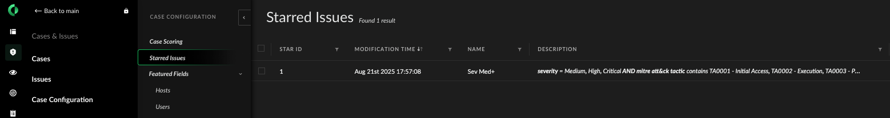

# Completing the SOC Optimization XSIAM Tenant Configuration

Once the tenant configuration is pushed with either the [POV Companion application](https://pov-companion.ts.paloaltonetworks.com/tenant-configurations) or
the [xsiam-pov-automation](https://github.com/annabarone/xsiam-pov-automation/tree/main) setup.py script, the following
manual steps still need to be done: 

---
## Quick Start
1. **Enable Auto Triage Job**
   * Choose Auto Triage and Enable
   * Refresh page and look for Running or Completed
2. **Configure Starring**
   * Star Issues on Medium or Higher + has MITRE Tactic

3. **Configure Automation Trigger**
   * NIST Incident Response Flow (800-61)
     * Trigger playbook "EP_IR_NIST(800-61)" on Medium Severity or Higher Alerts
     
--- 
## What Next?
1. XSIAM SOC Value Metrics Dashboard([Value Metrics](Documentation/Value_Metrics.md))
   * These require alerts with triggered playbooks tasks.
2. Customize Value Metrics tasks or playbooks "Use Cases" ([setValueTags.md](Documentation/setValueTags.md))
3. Observe Playbooks running in Issues table.
---

## Troubleshooting
* Check xsiam_playbookmetrics_raw exists -- Once alerts start to flow and automation get triggered the JOB will start collecting metrics based on the JOB run interval.

### Manual Configuration

#### 1 - Enable Job - Auto Triage 

To guarantee the configuration does not interfere with existing tenants without the SC/DC’s understanding, 
we have disabled the auto triage job by default. Once you are confident that the starred alerts for your 
tenant are set up properly, please enable the job.

1. Navigate to **Incident Response → Automation → Jobs**

2. Find the _Auto Triage_ Job

3. Click **Enable**

---
### Errored Jobs

If either of the "_Auto Triage_" or "_Collect Playbook Metrics_" jobs show as _**Error**_ for their _Last Run status_ as seen in 
this picture below, please follow these troubleshooting steps:

#### Verify Job's Playbooks Exist in Library

1. In the Playbook Library (**Incident Response -> Automation -> Playbooks**), verify that these playbooks exist. 
        
        JOB - Store Playbook Metrics in Dataset
        JOB - Triage Alerts

If they don't exist, the custom content installation of the "SOC Framework" pack failed.

#### Check Job's Playbook Registered

If the job's playbook shows as **"Missing/Deleted playbook"** in the job table even though the playbook exists in the library,
this may mean the job's playbook has not fully registered with the tenant yet. There is an observed timing gap between 
when a custom content pack gets installed and when the custom content's playbook can be used in a job. To resolve this issue:

1. Wait 30 to 60 minutes to give the tenant time to register the playbook 

- If you return, hard refresh the page, and the playbook is still missing, you will need to manually create the job. We recommend
disabling the broken job and recreating it with the same parameters.

- If you return, hard refresh the page, and the job's playbook shows as the correct playbook but the _Last Run status_ still 
shows as "**_Error_**", this is because the previous job runs need to be cleaned. These are the jobs that show as "Running". 
Continue with these steps to clean the jobs.

2. In the top right corner of the Jobs screen, click the hamburger menu to **Switch to Detailed View**.

3. If you do not have any Job Runs that show as _**Completed**_, you need to verify that the playbook is registered: 

   1. Click **Run now**
   
   2. Refresh the page 
   
   3. Click on the just-triggered Run ID
   
   4. Toggle to "_Work Plan_" tab
   
   5. Verify that the playbook was triggered for this alert. If not, you will need to manually recreate the job.

4. After verifying that the playbook gets properly triggered, we need to clean up the previous runs. For each of the jobs
that show as "Running", do the following: 

   1. Click on the Run ID
   
   2. Toggle to the "Work Plan" tab
   
   3. Click "Choose a playbook"

   4. Select "Close Alerts" or some other simple playbook that requires no input/output to close

5. Once you've completed close all running jobs, you should be good to go! 

