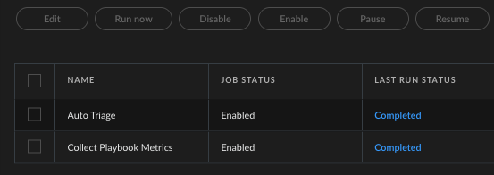
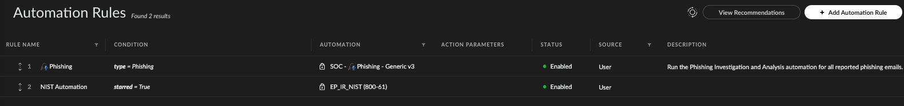
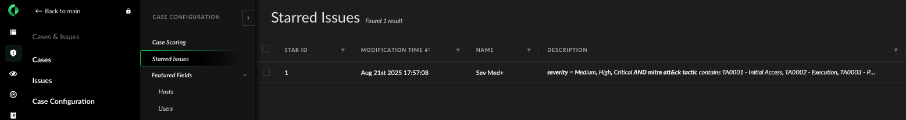
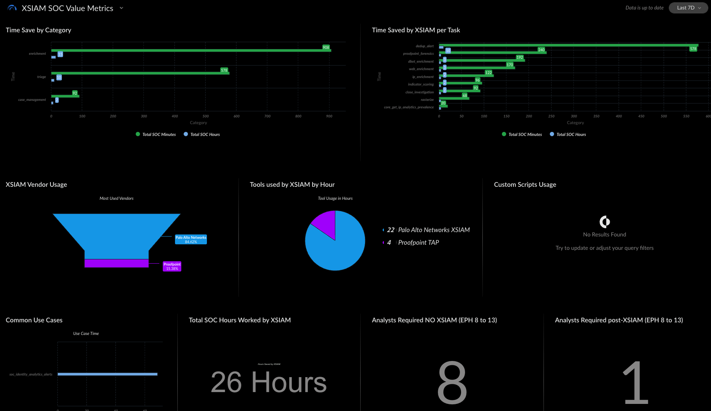

# ⚙️ SOC Optimization Framework for Cortex XSIAM (DEPRECATED)


This repo has moved: https://github.com/Palo-Cortex/secops-framework


This repository outlines a scalable SOC optimization approach tailored for Palo Alto Networks Cortex XSIAM. The goal is to reduce analyst fatigue, improve response time, and enable data-driven visibility into automation value. The solution is based on three core patterns and enhanced by modular design and operational safeguards.

---
# Quick Setup

- Get started fast with Auto Triage + Incident Response Catch-All. 
- These content packs get installed via the PoV Companion.

---

## 1. Enable Auto Triage
1. Read 👉 [Auto-Triage Usage](./Documentation/Auto_Triage.md) To Understand How it Closes Cases
2. Investigation & Response → Automation → Jobs
3. Check Auto Triage
4. Click Enable Button


---

## 2. Configure Automation Rules
1. Navigate: **Investigation & Response → Automation → Automation Rules**
2. Add Rule: Run Entry Point Playbook called **EP_IR_NIST(800-61)** if `starred = True`

   👉 [Learn more about Entry Point playbooks](https://github.com/Palo-Cortex/soc-optimization/blob/main/Documentation/EntryPoints.md)


  - **EP_IR_NIST(800-61)** is the *Incident Response Catch-All*.
  - You can create more specific rules above this (e.g., Phishing based on MITRE Technique T1566).

---

## 3. Configure Starring Rule
**Starred Issues define which alerts feed into Auto Triage.**
1. Navigate: **Cases & Issues → Case Configuration → Starred Issues**
2. Add Rule: Star alert if
  - `Severity >= Medium`
  - `Has MITRE Tactic`



## 4. XSIAM SOC Value Metric Dashboard
** Real-time metrics from PoV into production **
1. Dashboards & Reports → Dashboard → XSIAM SOC Value Metrics
2. Select 7 Days (More realistic for SOC reporting)


*Tips:* 
- Alerts must fire playbooks and playbook tasks must run before this dash works. 
- Dataset = `xsiam_playbookmetrics_raw`

---

# 🔁 Core Patterns

---

### 1. **Auto-Triage for Non-Starred Incidents**
- Incidents that are not marked with a star are automatically triaged using `JOB_-_Triage_Incidents.yml`.
- Ensures that high-volume, low-risk alerts are handled without manual intervention.

👉 [Auto-Triage Usage](./Documentation/Auto_Triage.md) — Automatically closes non-priority incidents to reduce alert fatigue.

### 2. **Modular Playbooking with the `Upon Trigger`**
- The `Upon Trigger` playbook is the engine of modular decision-making.
- It divides alert processing into four logical stages:
  - **Alert Triage**
  - **Enrichment**
  - **Auto Remediation**
  - **Assessment and Escalation**
- This playbook dynamically decides whether to run in **Shadow Mode** (safe/test) or **Full Mode** (production) using contextual data.
> 🔄 **Modular playbooking starts with Entry Point playbooks** — Each MITRE Tactic has its own Entry Point (e.g., `EP_Execution`, `EP_InitialAccess`) that routes execution based on blue/green deployment state. This allows for seamless promotion and rollback of playbooks in production environments.
>
> 👉 [Learn more about Entry Point playbooks](https://github.com/Palo-Cortex/soc-optimization/blob/main/Documentation/EntryPoints.md)

👉 [See when to use the Upon Trigger](https://github.com/Palo-Cortex/soc-optimization/blob/main/Documentation/Upon_Trigger.md)


### 3. **Value Metrics for Automation Efficiency**
- The `JOB_-_Store_Playbook_Metrics_in_Dataset.yml` playbook collects key metrics and stores them in a dataset.
- Combined with the `value_tags` lookup table, metrics enable dashboards to measure:
  - ⏱️ **Time saved** by XSIAM automations.
  - 📊 **Time spent** by category (triage, enrichment, remediation, etc.).
  - 🔌 **Vendor product usage** across automations.
  - 🛠️ **Custom scripting vs. out-of-the-box content**.
  - 📈 **Alert metrics per data source**:
    - Alert volume
    - Grouping effectiveness
    - Auto-remediation success rate
    - Analyst review backlog

👉 [See how to use the Value Metrics](https://github.com/Palo-Cortex/soc-optimization/blob/main/Documentation/Value_Metrics.md)

### 4. **Blue / Green Deployment Model**

This script enables a **blue/green deployment strategy** for Cortex XSIAM playbooks using a centralized list called `PlaybookDeploymentMatrix`.

Each Entry Point (EP) tracks:
- A `prod` playbook (live in production)
- A `green` playbook (staged for testing)

##### ✅ Benefits
- 🔄 **Safe Playbook Promotion**: Easily test and promote playbooks without disrupting production.
- 🚫 **Instant Rollback**: Quickly revert if a green version causes issues.
- 🔍 **Clear Visibility**: View current deployment states via command.
- 🛡️ **Controlled Changes**: Use the `enabled` flag to gate deployment activity.

👉 [How to Use Blue / Green Deployment](https://github.com/Palo-Cortex/soc-optimization/blob/main/Documentation/Blue_Green.md)

Additionally, all Entry Point playbooks are driven by **MITRE Tactic tags** and function as smart routers, pulling the correct playbook version based on deployment state. This supports safe DevOps-style promotion and rollback.

---

## 🧩 Playbook Structure

### Main Playbooks:
- **Upon Trigger** – Modular logic engine for alert decisioning
- **Emergency Resolver** – Escalation logic for critical alert closures

### Job Playbooks:
- **JOB_-_Triage_Incidents.yml** – Auto-triages non-starred incidents
- **JOB_-_Store_Playbook_Metrics_in_Dataset.yml** – Stores value metrics

---

## ⚙️ Configuration and Lists

This framework uses system-level lists for dynamic context:

- **`SOCOptimizationConfig`**  
  Stores runtime configuration flags, such as enabling/disabling Shadow Mode.

- **`AssetTypes`**  
  Documents high-value or administrative assets to influence alert escalation.

- **`ProductionAssets`**  
  Controls which assets bypass Shadow Mode and receive live remediation.

- **`JobUtilityBulkAlertCloserIDList`**  
  Used by the Emergency Resolver to safely close large volumes of alerts within thresholds.

---

## 🧪 Shadow Mode Logic

Shadow Mode is a key safety mechanism. It ensures actions like `isolate_endpoint` or `disable_user` are logged but **not executed** in test scenarios. Shadow Mode decisions are:
- Made in the `Upon Trigger` playbook.
- Stored in the incident’s data context.
- Controlled via `ProductionAssets` and `SOCOptimizationConfig` lists.

---

## 📊 Metrics and Dashboards

The metrics collected are designed to demonstrate **operational value**:

| Metric Type         | Description                                                                 |
|---------------------|-----------------------------------------------------------------------------|
| Time Saved          | Total analyst time replaced by automation                                   |
| Time Spent          | Time breakdown across enrichment, triage, remediation, etc.                 |
| Vendor Usage        | How often and where each vendor’s integration is leveraged                  |
| Custom Content Use  | Measures reliance on custom scripts vs out-of-the-box playbooks             |
| Alert Source Metrics| Insight per data source: volume, grouping, remediation, and leftovers       |

---

## 📷 Visual Overview


> *Diagram illustrates the four-stage logic inside the Upon Trigger playbook: Alert Triage, Enrichment, Auto Remediation, and Assessment & Escalation.*

## 🔧 Repository Structure and Usage

```
.
├── Supporting Playbooks
│   └── SOC Common Playbooks
│
├── Optimization Layer (Optional)
│   ├── EP IR NIST (800-61)             - Entry Point playbook for SOC NIST IR (800-61)
│   ├── SOC NIST IR (800-61)            - Runs the NIST framework for incident response
│   ├── SOC Phishing - Generic v3       - Runs a one off Phishing playbook.
│   ├── EP MITRE Tactic                 - Entry Point playbook for MITRE Tactic playbooks. Allows for Blue / Green Deployments
│   ├── MITRE - Execution               - Runs MITRE Execution automations
│   ├── MITRE - Initial Access          - Runs MITRE Initial Access automations
│   └── JOB - Triage Alerts             - Automatic Triage to close Low Fidelity Alerts
│
├── Product Enhancements
│   ├── SOC ProofPoint TAP (Optional)
│   ├── SOC Microsoft Defender (Optional)
│   ├── SOC Microsoft Graph Security (Optional)
│   ├── SOC CrowdStrike Falcon (Optional)
│   └── ...
│
├── scripts
│   ├── DeployPlaybook                  - Blue / Green Deployment Script
│   ├── EntryPointGBState               - Blue / Green Router
│   ├── ShadowModeRouter                - Conditional task script that runs the playbook in Full Run or Shadow Mode
│   ├── SOC_NormalizeContext            - Normalizeds Artifacts in Data Context (i.e. user, IPs, domains, urls, etc.)
│   └── setValueTags                    – Maintains `value_tags` table for metrics and dashboards
```
---

## 📘 Description

This repository enables modular, scalable playbook deployment in Cortex XSIAM, tailored for key SOC use cases.

- **Use Case Playbooks** (NIST IR "Incident Response" (800-61) ) is the catch-all for operational support.
- **SOC Optimization** (optional) overlays efficiency patterns inspired by the Palo Alto Networks SOC to enhance all use case workflows.
- **Product Enhancement Packs** for `CrowdStrike Falcon` and `ProofPoint TAP` enrich detection and response capabilities by leveraging product-specific context in XSIAM.
